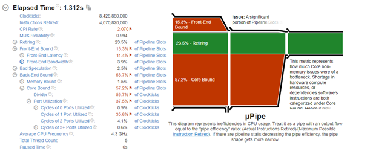
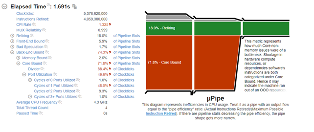
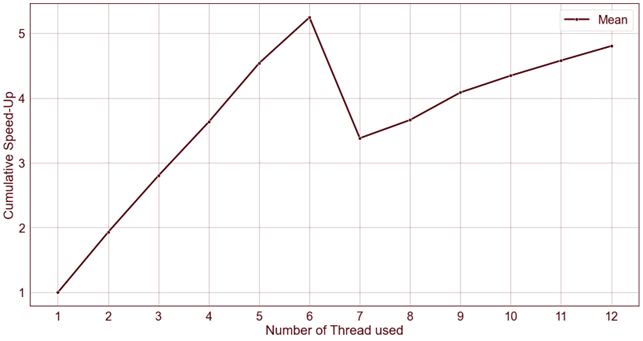
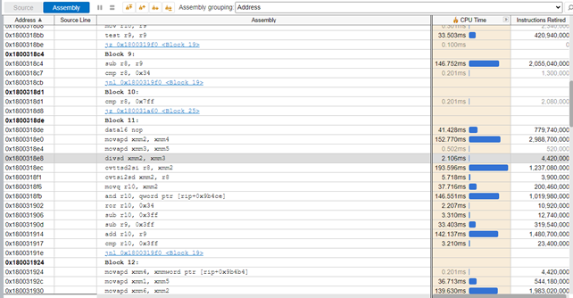
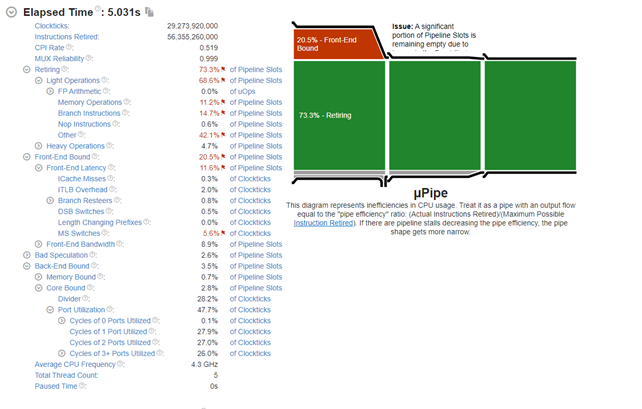
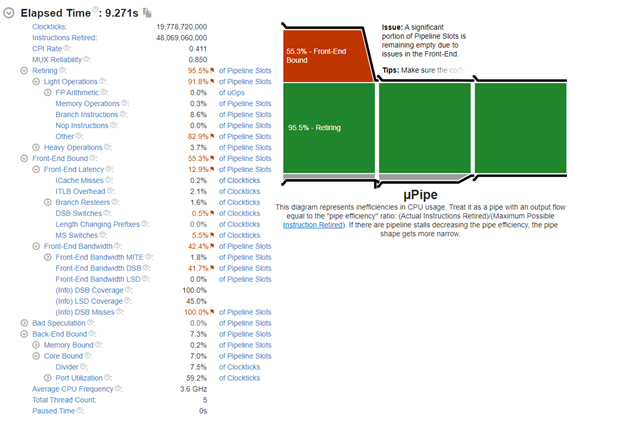
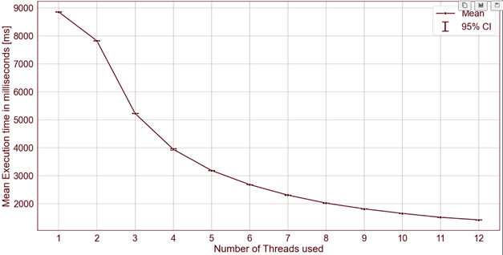
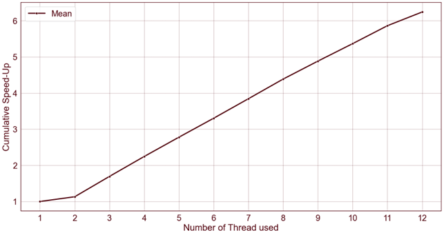

# CPU Insights

This document provides detailed insights into the **CPU** implementation of the trial division algorithm.

## Divider Utilization Analysis

### 2 Threads with Same Core Affinity
When executing the algorithm with 2 threads assigned to the same core, the Intel VTune Profiler provides the following details:



The divider utilization is approximately 56%. This relatively low utilization is due to both threads interfering with each other as they synchronize access to shared physical resources on the same core.

### Single Thread Execution
When the algorithm is executed with just one thread, the divider utilization increases to 88%, as shown below:



Notably, the execution time remains approximately the same, indicating that the interference between threads on the same core significantly impacts divider utilization without affecting overall performance.

### One Thread per Core
Assigning one thread per core (up to 6 threads) results in a high divider utilization of 92%. This configuration maximizes the usage of available resources and reduces thread interference. The cumulative speed-up achieved is depicted in the following graph:



## DIV or FDIV Instruction?

### Checking for DIV or FDIV
The professor inquired about the presence of the DIV or FDIV instruction in the assembly code. To force the use of the floating-point divider, we employed the `fmod` function instead of the classical `%` operator. The following code was used:
```cpp
double float_mod = (double) fmod(num, i);
if (float_mod == 0.0) {
    cout << " Num ("<< num <<") is divisible by i ("<< i <<")\n";
}
```

The generated assembly code for the `fmod` function is as follows:



According to a reliable Stack Overflow source (https://stackoverflow.com/a/48334134), the instruction used is indeed a floating-point division.

When utilizing both FDIV and DIV in the code, the utilization of the integer dividers drops to 28.2%:



## Dummy Wait

To reduce the usage of the DIV instruction, we introduced a dummy wait after the integer division. The following code snippet illustrates this approach:
```cpp
bool condition = (num % i) == 0;

int j, sum = 0;
for (j = 0; j < 99; j++)
	sum += j;
		
if(condition) cout << "j: " << j << " sum: " <<sum<<endl;

if (condition) {
    cout << "i: " << i << endl;
    /* ... */
}
```

As anticipated, this modification results in very low divider utilization, only 7.5%:



Plotting the Mean Execution Time against the number of threads reveals a significant increase in execution time due to the dummy wait. Furthermore, now the Mean Execution Time with 1 or 2 Threads is not the same, as shown in the following graph.



The Cumulative Speed-up instead is depicted in the following graph:




## Additional Considerations:

- **Utilize the SIMD co-processor**
  - Optionally, explore using the SIMD co-processor available within the CPU to execute complex operations in parallel, potentially improving performance.

- **Implement the modulo operation as a while loop**
  - As an alternative approach, the modulo operation can be implemented using a while loop, e.g., `5 % 2`: `5 - 2 = 3 - 2 = 1 != 0`.

