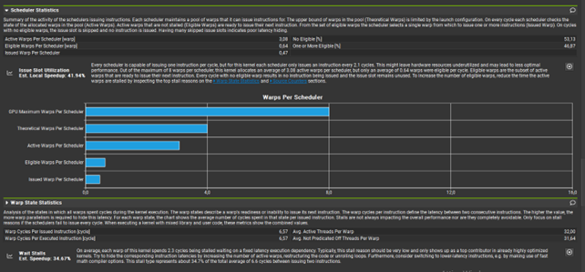
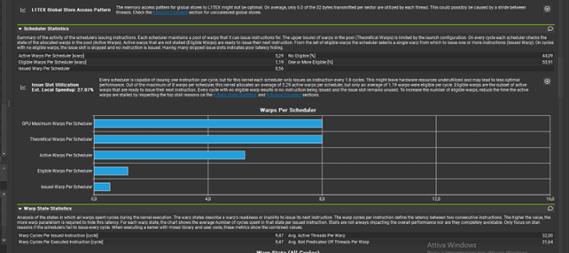
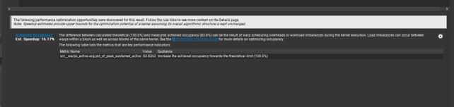
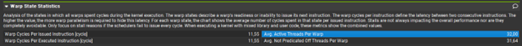

# GPU Insights

This document provides detailed insights into the **GPU** implementation of the trial division algorithm.

## GPU Configuration and Utilization

### Key GPU Parameters

- **Max blocks per multiprocessor**: 16
- **Max warps per multiprocessor**: 32
- **Max warps per scheduler**: 8

### Utilization Analysis

#### 32 Threads per Block
With 32 threads per block, the GPU utilization is depicted as follows:

#### 64 Threads per Block
When the number of threads per block is increased to 64, a higher utilization is achieved:

### Maximum Utilization

Running 640 blocks with 64 threads per block appears to be the optimal configuration. After this point, no significant improvements are observed.

For additional details, refer to the Nsight saved file available in `Resources/640Blocks_64Threads_18digits.ncu-rep`.

### GPU Optimization Notes

- **Thread Limits**: It is impossible to exceed 1024 threads per block.
- **Warp Characteristics**:
  - Each warp consists of 32 threads.
  - Divergence occurs only within a warp.
  - Different warps execute independently.
  - Warp-to-warp context switch is free!

## NVIDIA Nsight Compute: Understanding "Not Predicated Off Threads per Warp"

In NVIDIA Nsight Compute, the "Not Predicated Off Threads per Warp" metric measures the average number of threads per warp that actively execute an instruction without being skipped due to predicate conditions. 

### Key Components

1. **Warp**: A group of 32 threads in NVIDIA's GPU architecture that execute the same instruction simultaneously.
2. **Predicated Off**: In SIMD architectures, instructions can be conditionally executed using predicates. When a thread is "predicated off," it means the thread does not execute the instruction due to the predicate condition.

### Metric Explanation

"Not Predicated Off Threads per Warp" counts the number of threads in a warp that execute an instruction. 

#### Example Calculation
If a warp of 32 threads has an instruction predicated such that only 20 threads execute it, the metric value is 20, with the remaining 12 threads being predicated off.

### Average Calculation
This metric is averaged over all warps and instructions during a kernel execution. It provides an average value indicating the typical number of active threads per warp for the instructions being analyzed.

### Usage
- **Efficiency Indicator**: This metric helps understand the efficiency of instruction execution within warps. 
  - **Lower Value**: Indicates more threads are predicated off, suggesting potential inefficiencies in GPU parallel processing.
  - **Higher Value**: A value closer to 32 indicates most threads are actively participating in instruction execution, implying better efficiency.

In summary, the "average not predicated off threads per warp" metric offers insights into how effectively the threads within each warp are utilized during kernel execution by measuring the average number of threads that are *not* skipped due to predicate conditions.

## Additional Resources

- **Tutorial on CUDA Programming**: A useful video tutorial on CUDA programming can be found [here](https://www.youtube.com/watch?v=xwbD6fL5qC8).
- **CUDA Atomic Operations**: An informative discussion on whether CUDA atomic operations occur at the thread or block level can be found on [Stack Overflow](https://stackoverflow.com/a/57115601).